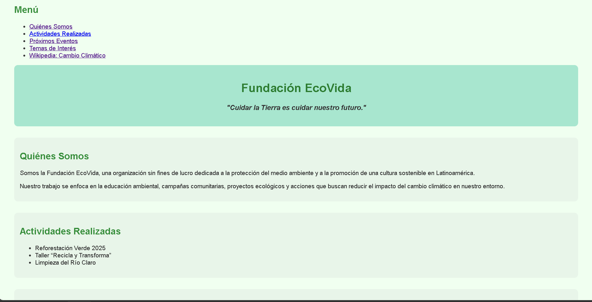
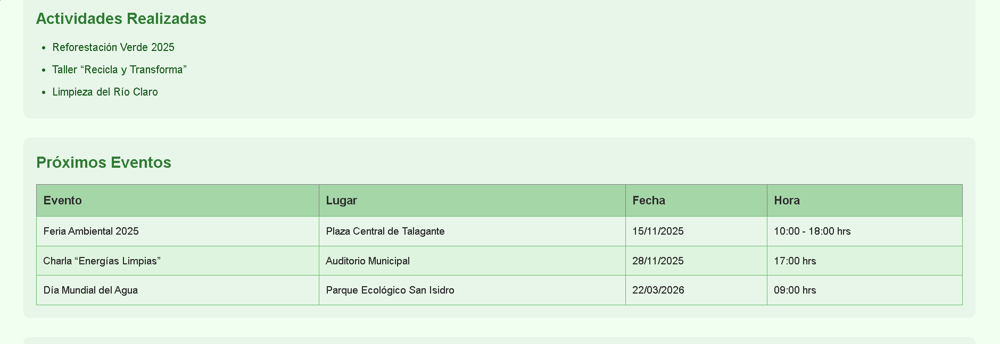

📘 README.md — Proyecto Fundación EcoVida
# 🌿 Fundación EcoVida — Sitio Web Educativo

Sitio web educativo desarrollado para el **Instituto Profesional IACC**, utilizando **HTML**, **CSS** y **JavaScript**.  
El proyecto presenta contenido informativo relacionado con la sostenibilidad ambiental, incluyendo actividades realizadas, eventos planificados y temas relevantes como el cambio climático.

Este repositorio se irá actualizando conforme avance el proyecto e incorpore nuevas funcionalidades y mejoras.

---

## Vista previa del proyecto




## 📌 Objetivo del Proyecto

Crear un sitio web simple y educativo sobre la Fundación EcoVida, con el fin de aplicar los contenidos aprendidos en el curso:

- Estructura HTML semántica  
- Estilos básicos con CSS  
- Uso inicial de JavaScript  
- Manejo de imágenes, tablas, audio y enlaces  
- Navegación mediante anclas

---

## 📁 Estructura del Proyecto


```
/proyecto-ecovida
/img
/audio
index.html
style.css
script.js (próximamente)
README.md
```

> *Las carpetas de imágenes y audio se agregarán conforme se suban los recursos.*

---

## 📄 Contenido Actual del Sitio

Hasta esta etapa del proyecto, el sitio incluye:

### ✔ Navegación
- Menú con enlaces a:
  - Quiénes Somos  
  - Actividades  
  - Eventos  
  - Temas de Interés  
  - Enlace externo a Wikipedia

### ✔ Secciones Principales
- **Quiénes Somos:** breve descripción de la fundación.  
- **Actividades Realizadas:** lista no enumerada.  
- **Próximos Eventos:** tabla con lugar, fecha y horario.  
- **Temas de Interés:** información sobre cambio climático, tres imágenes y un audio.

---

## 🛠 Tecnologías Utilizadas

- **HTML5:** estructura y contenido.  
- **CSS3:** estilos básicos y diseño.  
- **JavaScript (próximo):** interacciones simples.  
- **Git / GitHub:** control de versiones y documentación del proyecto.

---

## 🚀 Próximas Mejoras (Roadmap)

- Añadir estilos responsive en CSS.  
- Implementar interactividad con JavaScript.  
- Crear un footer más completo (redes sociales, formulario de contacto).  
- Separar el proyecto en múltiples páginas si es requerido.  
- Implementar validaciones y pequeños scripts educativos.

---

## 📬 Contacto

**Autor:** Javier  
**Institución:** Instituto Profesional IACC  
**Propósito:** Proyecto educativo — Desarrollo Web

---

## 📄 Licencia

Este proyecto es de uso educativo.  
Puedes revisarlo, aprender de él y adaptarlo, pero evita su uso con fines comerciales.

---