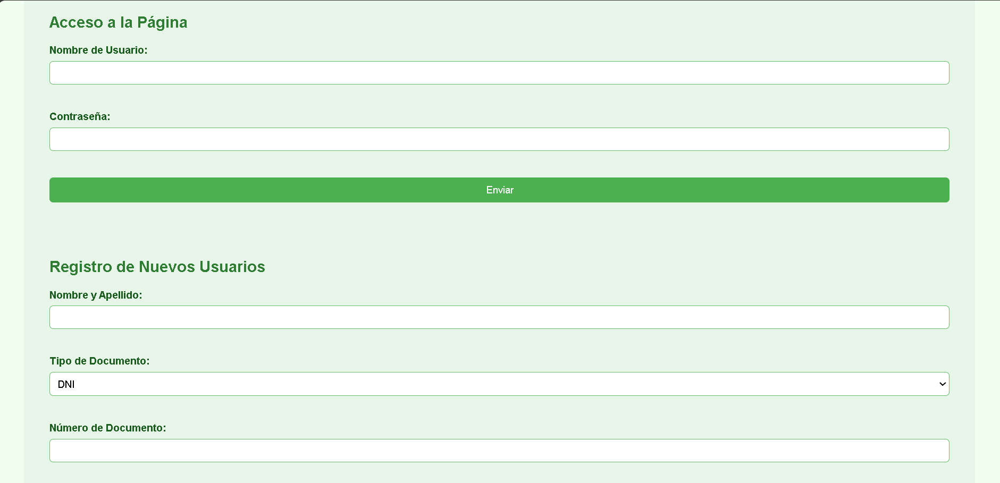
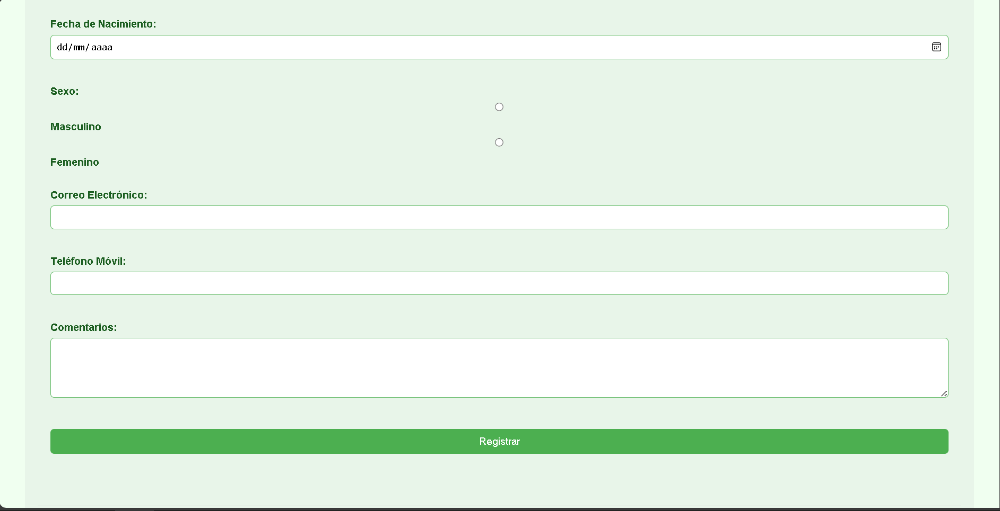

# 🌿 Fundación EcoVida — Sitio Web Educativo

Sitio web educativo desarrollado para el **Instituto Profesional IACC**, utilizando **HTML**, **CSS** y próximamente **JavaScript**.  
El proyecto presenta contenido informativo sobre sostenibilidad ambiental, actividades comunitarias y concientización sobre el cambio climático.

Este repositorio se actualiza semanalmente según los requerimientos del curso.

---

## 📸 Vista previa del proyecto

  

  

  


---

## 📌 Objetivo del Proyecto

Crear un sitio web simple y educativo que permita aplicar los conocimientos de HTML y CSS adquiridos en la asignatura:

- Estructura HTML semántica  
- Uso de estilos con CSS  
- Manejo de tablas, listas, imágenes, audio y video  
- Formularios básicos  
- Navegación mediante anclas  

---

## 📁 Estructura del Proyecto

```
/proyecto-ecovida
/img
/audio
index.html
style.css
script.js (próximo)
README.md
```
---

## 📄 Contenido Actual del Sitio

Hasta esta etapa, el sitio incluye:

### ✔ Navegación
- Enlaces internos a:
  - Quiénes Somos  
  - Actividades  
  - Eventos  
  - Temas de Interés  
- Enlace externo a Wikipedia

### ✔ Secciones Principales
- **Quiénes Somos:** descripción de la fundación  
- **Actividades Realizadas:** lista de acciones comunitarias  
- **Próximos Eventos:** tabla con fechas, lugares y horarios  
- **Temas de Interés:** imágenes, descripción y audio  
- **Videos Relacionados:** reproducción de video desde YouTube  
- **Formularios:** acceso y registro de usuarios  

---

## 🎨 Cambios recientes

En esta etapa se realizó una **mejora visual completa** mediante CSS:

### ✔ Actualizaciones al CSS
- Rediseño general del estilo visual  
- Tablas estilizadas con colores, bordes y alternancia de filas  
- Formularios con campos más legibles y botones mejorados  
- Navegación con fondo y espaciado más claro  
- Secciones con mejor contraste y padding  
- Estética general más moderna y uniforme  

Estas mejoras se aplicaron exclusivamente a `style.css`.

---

## 🛠 Tecnologías Utilizadas

- **HTML5**  
- **CSS3**  
- **JavaScript** *(en desarrollo para próximas semanas)*  
- **Git / GitHub**  

---

## 🚀 Próximas Mejoras

- Optimización responsive completa  
- Interactividad con JavaScript  
- Implementación opcional de modo oscuro  
- Posible separación en múltiples páginas  
- Validaciones para los formularios  

---

## 📬 Contacto

**Autor:** Javier  
**Institución:** Instituto Profesional IACC  
**Propósito:** Proyecto educativo — Desarrollo Web  

---

## 📄 Licencia

Este proyecto es de uso exclusivamente educativo.