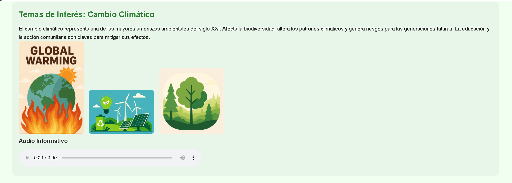
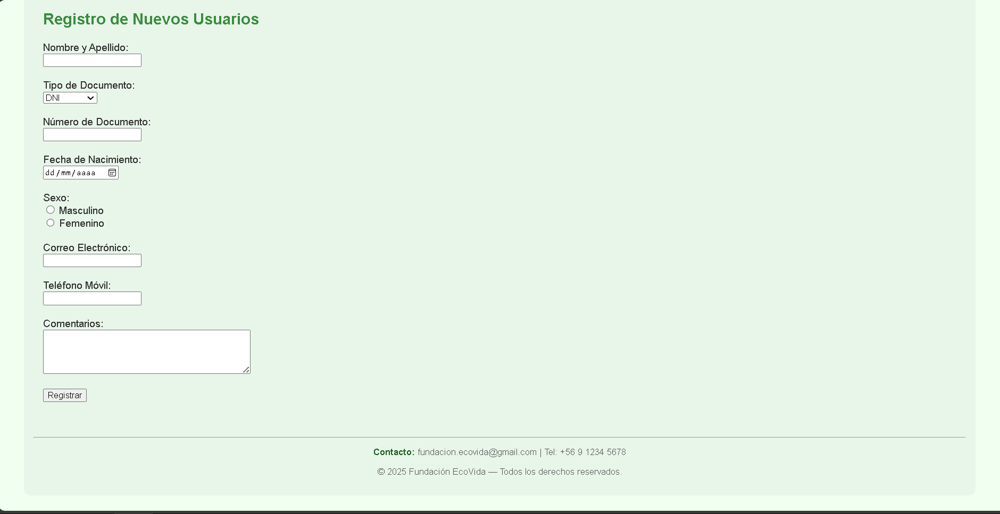

# 🌿 Fundación EcoVida — Sitio Web Educativo

Sitio web educativo desarrollado para el **Instituto Profesional IACC**, utilizando **HTML**, **CSS** y **JavaScript**.  
El proyecto presenta contenido informativo relacionado con la sostenibilidad ambiental, incluyendo actividades realizadas, eventos planificados, temas de interés y recursos multimedia.

Este repositorio se irá actualizando conforme avance el proyecto e incorpore nuevas funcionalidades y mejoras solicitadas en cada semana del módulo.

---

## 🖼️ Vista previa del proyecto

  

  


---

## 📌 Objetivo del Proyecto

Crear un sitio web educativo para la Fundación EcoVida, aplicando los contenidos del curso:

- Estructura HTML semántica  
- Estilos básicos con CSS  
- Uso inicial de JavaScript (próximamente)  
- Manejo de imágenes, tablas, audio, video y enlaces  
- Navegación mediante anclas  
- Formularios básicos de acceso y registro  
- Inserción de contenido multimedia mediante iframe

---

## 📁 Estructura del Proyecto

```
/proyecto-ecovida
│
├── /img
├── /audio
├── index.html
├── style.css
├── script.js (próximamente)
└── README.md
```

> Las carpetas de imágenes, videos y audios se irán completando conforme avanza el proyecto.

---

## 📄 Contenido Actual del Sitio

### ✔ Navegación
- Menú con enlaces ancla a todas las secciones del sitio.
- Enlace externo a Wikipedia sobre cambio climático.

### ✔ Secciones Principales
- **Quiénes Somos:** descripción general de la fundación.
- **Actividades Realizadas:** lista no enumerada con acciones comunitarias.
- **Próximos Eventos:** tabla con lugar, fecha y horario.
- **Temas de Interés:**  
  - Información educativa sobre cambio climático  
  - **Tres imágenes ilustrativas**  
  - **Audio informativo**  

### ✔ Nuevas Incorporaciones
- **Sección “Videos Relacionados”:** inserción de un video educativo mediante iframe.  
- **Formulario de Acceso:** usuario y contraseña con botón enviar.  
- **Formulario de Registro:** campos solicitados por la pauta:  
  - Nombre y apellido  
  - Tipo y número de documento  
  - Fecha de nacimiento  
  - Sexo  
  - Email  
  - Teléfono  
  - Comentarios  

Estas secciones permiten aplicar etiquetas de formularios, entradas de datos y uso de elementos multimedia.

---

## 🛠 Tecnologías Utilizadas

- **HTML5:** estructura, formularios y multimedia  
- **CSS3:** estilos y diseño del sitio  
- **JavaScript:** (se implementará en las próximas semanas)  
- **Git / GitHub:** control de versiones, documentación y despliegue

---

## 🚀 Próximas Mejoras (Roadmap)

- Añadir estilos responsive y mejor organización visual.  
- Implementar interactividad con JavaScript (validaciones y DOM).  
- Optimizar la accesibilidad del sitio.  
- Separar el sitio en múltiples páginas si la pauta lo requiere.  
- Agregar alertas, efectos y pequeñas funciones dinámicas.

---

## 📬 Contacto

**Autor:** Javier  
**Institución:** Instituto Profesional IACC  
**Propósito:** Proyecto educativo — Desarrollo Web

---

## 📄 Licencia

Este proyecto es de uso educativo.  
Puedes revisarlo y adaptarlo, pero evita su uso con fines comerciales.